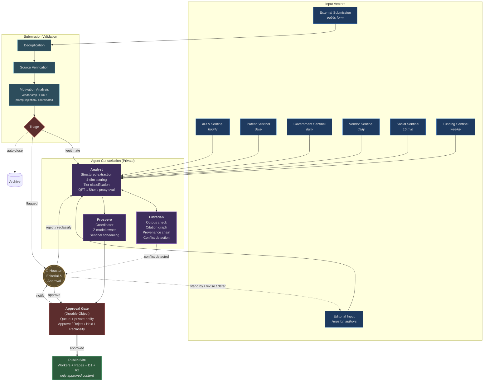
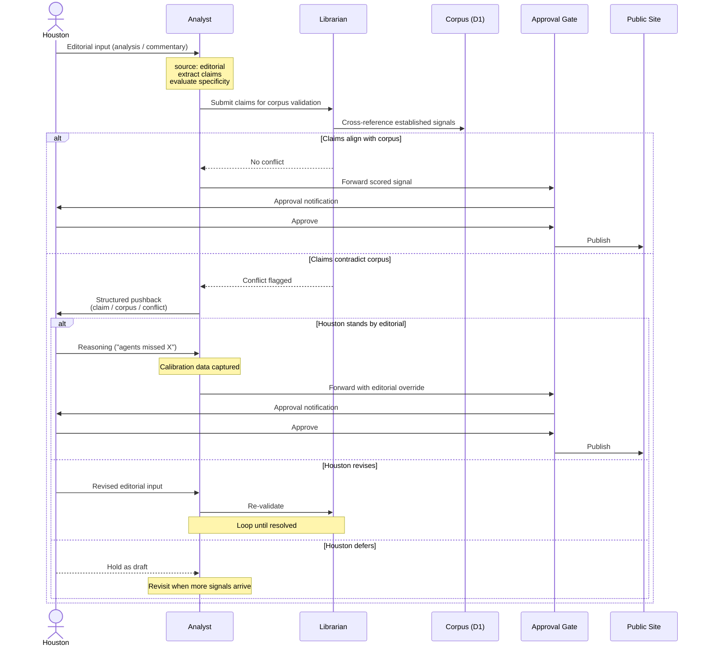
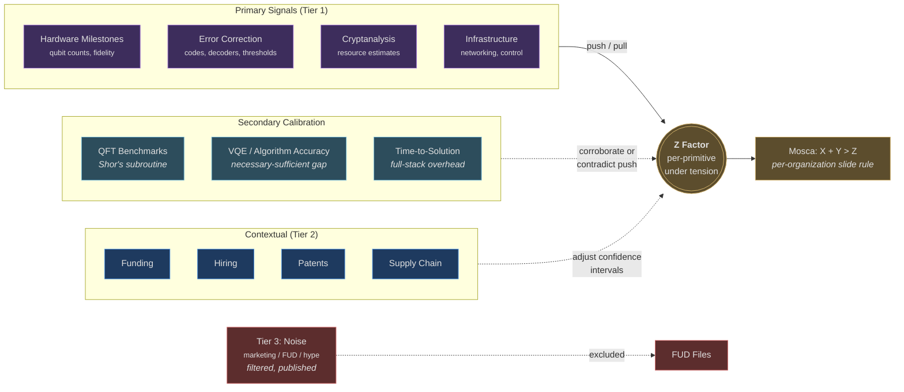
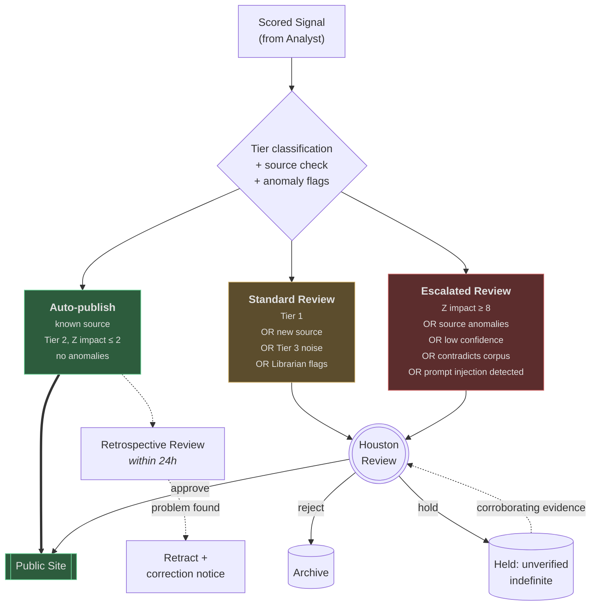

## Overview

The CRQC Index agent constellation runs on Cloudflare as a set of Durable Objects coordinated by Prospero. Three input vectors feed the Analyst → Librarian → Approval Gate pipeline. The editorial input vector is bidirectional: agents push back when editorial claims contradict the established corpus.

These diagrams complement the prose architecture in `crqc-index-design-scaffold.md`. They are the canonical visual reference for how signals move through the system.

## Full System Flow

## Editorial Pushback Flow

The editorial input vector is the only one where agents push back to the human. This sequence diagram shows the dialogue.

## Z Estimation Signal Flow

How signals push or pull Z, including the secondary calibration role of application-level benchmarks.

## Approval Tier Routing

How signals flow through the three approval tiers based on Analyst scoring and characteristics.

## Notes

- All Durable Objects communicate via BAREWire-encoded LARP messages internally; the diagrams omit message format for clarity.
- The `Archive` data store is shared across triage paths but holds different metadata depending on rejection reason (spam, duplicate, fabricated source, manual reject).
- Sentinel cadences shown are targets; actual scheduling is managed by Prospero based on source rate-limit constraints.
- The editorial pushback dialogue is private — none of it appears on the public site unless Houston approves the resulting signal for publication.
